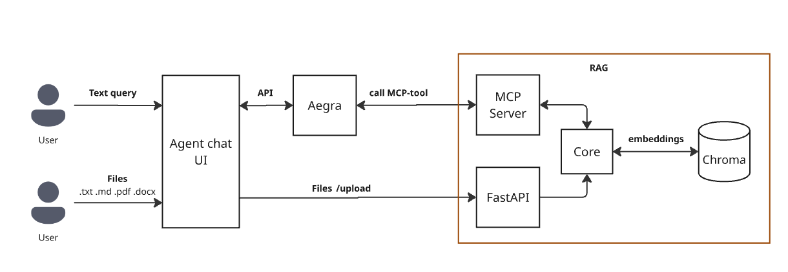

# 🤖 RAG-Agent

Простой и мощный Retrieval-Augmented Generation (RAG) агент для локального использования.

---

Конечно! Вот отформатированная и стилистически выровненная версия вашего раздела — чётко, читаемо и профессионально:

---

## 🚀 Локальный запуск всего проекта

Следуйте этим шагам, чтобы запустить **RAG-Agent + Aegra + UI** локально:

### 1. Перейдите в корневую директорию проекта
```bash
cd aegra
```

### 2. Запустите необходимые сервисы в Docker
```bash
docker compose up postgres chroma -d
```
> Это запустит PostgreSQL (для Aegra) и ChromaDB (для RAG) в фоне.

### 3. Активируйте Python-окружение
```bash
source venv/bin/activate  # Linux/macOS
# Или для Windows:
# venv\Scripts\activate
```

### 4. Запустите Aegra-сервер
```bash
python run_server.py
```

### 5. Перейдите в корень проекта (если не там)
```bash
cd ..
```

### 6. Запустите веб-интерфейс
```bash
sh ui_agent.sh
```
> UI будет доступен по адресу: [`http://localhost:3000`](http://localhost:3000)

---

### 💡 Как использовать RAG в чате

- Используйте кнопку **«Upload file to KB»**, чтобы загрузить `.txt` или `.md` файлы в базу знаний.
- После загрузки **задайте вопрос в чате**, содержащий ключевое слово **`t2t`** (например: *«t2t: что написано в документе о проекте?»*).
- Агент автоматически выполнит поиск по вашей базе знаний и вернёт релевантный ответ.

> 🔒 На данный момент поддерживается только **text-to-text (T2T)** режим. Поддержка T2SQL будет добавлена позже.

--- 

Теперь у вас полностью рабочая локальная инфраструктура:  
**Aegra (агент-оркестратор) + RAG (база знаний) + Agent Chat UI (фронтенд)**.

## 🏎 Локальный запуск Rag

Следуйте этим шагам, чтобы запустить проект на своей машине:

### 1. Перейдите в директорию проекта
```bash
cd rag
```

### 2. Запустите зависимости через Docker Compose
```bash
docker compose up -d
```

### 3. Настройте виртуальное окружение Python
```bash
python -m venv venv
source venv/bin/activate  # Linux/macOS
# Для Windows: venv\Scripts\activate
```

### 4. Установите зависимости
```bash
pip install -r requirements.txt
```

### 5. Настройте переменные окружения
Создайте файл `rag/.env` со следующим содержимым:

```env
YANDEX_CLOUD_FOLDER=your_folder_id
YANDEX_CLOUD_API_KEY=your_api_key
```

> ⚠️ **Важно**: Замените `your_folder_id` и `your_api_key` на реальные значения из вашего аккаунта Yandex Cloud.

### 6. Запустите агента
```bash
python main.py --load-kb --query "<Your question>"
```

Пример:
```bash
python main.py --load-kb --query "Как работает RAG?"
```

---

💡 **Совет**: Флаг `--load-kb` загружает базу знаний при первом запуске. В последующих запросах его можно опустить, если база уже загружена.


### 📚 Расширение базы знаний

При запуске агента все файлы из директории `/knowledge_base` автоматически индексируются и загружаются в векторную базу данных.

Структура папки `/knowledge_base`:

```
/knowledge_base
├── docs/          # Описание схемы базы данных (в формате .md)
├── sql_examples/  # Примеры пользовательских запросов и соответствующих SQL-запросов
│                  # Каждый файл содержит пару: 
│                  # - текстовый запрос от пользователя (natural language)
│                  # - корректный SQL-запрос в ответ
└── t2t_docs/      # Документация в формате Markdown (.md или .txt) для text-to-text обработки
```

> 💡 **Совет**: Чтобы расширить знания агента — просто добавьте новые файлы в соответствующие подпапки. При следующем запуске с флагом `--load-kb` они будут учтены.


# Архитектура
